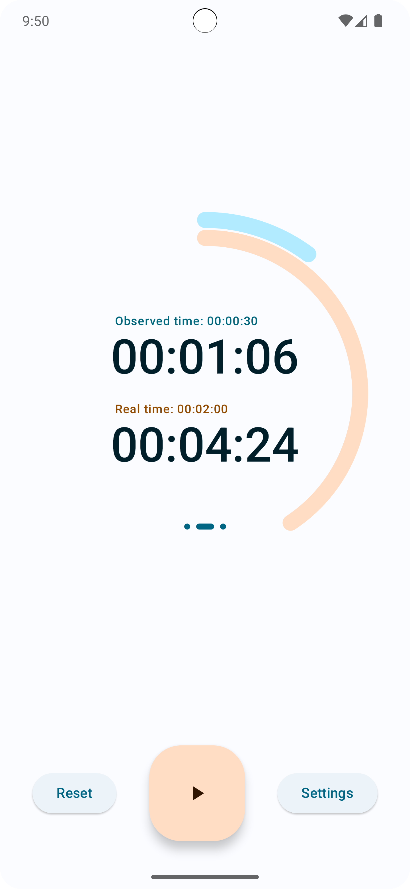
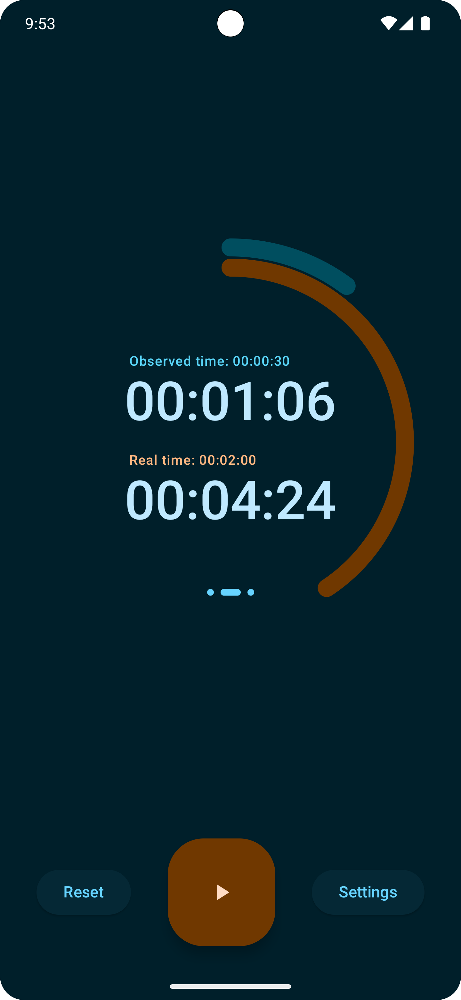
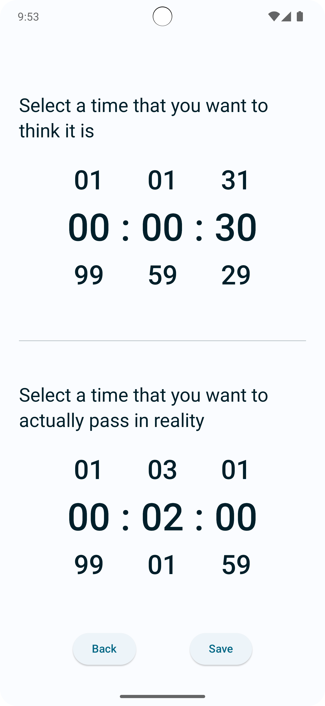
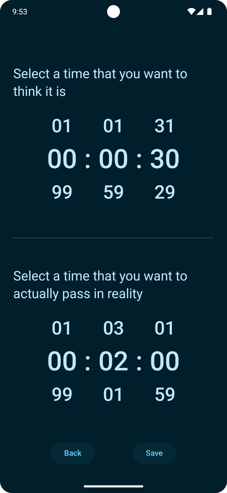

# Plank Timer ⏱️ (👷🏻work in progress 🚧)

Plank timer is an Android and iOS app written (almost) entirely in [Compose Multiplatform](https://www.jetbrains.com/lp/compose-multiplatform/).

## Showcase

| **Home Screen (Light Mode)**                                                                              | **Home Screen (Dark Mode)**                                                                             |
|-----------------------------------------------------------------------------------------------------------|---------------------------------------------------------------------------------------------------------|
|      |      |
| **Settings Screen (Light Mode)**                                                                          | **Settings Screen (Dark Mode)**                                                                         |
|  |  |

## Development setup

- check your system with [KDoctor](https://github.com/Kotlin/kdoctor)
- install JDK 17 on your machine
- add `local.properties` file to the project root and set a path to Android SDK there

### Android

To run the application on android device/emulator:

- open project in Android Studio and run imported android run configuration

To build the application bundle:

- run `./gradlew :androidApp:assembleDebug`
- find `.apk` file in `androidApp/build/outputs/apk/debug/androidApp-debug.apk`

### iOS

To run the application on iPhone device/simulator:

- Open `iosApp/iosApp.xcproject` in Xcode and run standard configuration
- Or use [Kotlin Multiplatform Mobile plugin](https://plugins.jetbrains.com/plugin/14936-kotlin-multiplatform-mobile) for Android Studio

## Contributions

If you've found an error in this sample, please file an issue.

Patches are encouraged and may be submitted by forking this project and submitting a pull request. Since this project is still in its very early stages, if your change is substantial, please raise an
issue first to discuss it.

